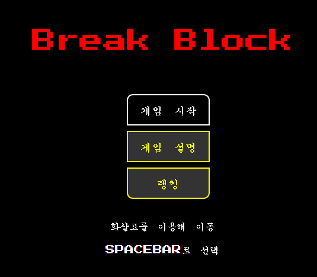

# 1차 프로젝트

## 주제 : Html과 css, Javascript, jQery를 활용하여 벽돌깨기 웹 게임 제작

* 제작기간 : 24.07.12 ~ 24.07.22

* 제작인원 : 3명  
    > 맡은 역할 :  
        \- 팀장  
        \- 아이템 기능 구현 \-  
            1. 바 길이가 늘어나는 아이템  
            2. 게임에 사용되는 생명 추가 아이템  
            3. 다음 스테이지 전환 아이템  
            4. 공 속도 증가 아이템  
            5.아이템 블록 파괴 시 아이템이 아래로 낙하   
        \- 전반적 게임 디자인 구현 \-  
            1. 맵의 크기 조절  
            2. 시작 버튼, 종료 버튼 홈 버튼 구현  
            3. 점수 표시 화면 구현  
            4. 화면 기본 배치   
        \- 팀원이 구현한 기능 연결 \-  

* 프로젝트 목표

    \: html과 css, javascript, jQuery를 활용하여 벽돌깨기 웹 게임을 제작

* 프로젝트 내용

    사용기술 
    > 사용 SW : VScode  
    > 사용 언어 : html, css, Javascript, jQuery

    결과물
    > 
    

        
    
