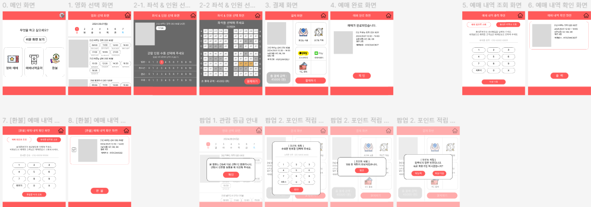

# 2차 프로젝트

## 주제: JAVA GUI를 활용한 영화관 키오스크 프로그램 제작

* 제작기간 : 24.08.23 ~ 24.09.20

* 제작인원 : 5명  
    > 맡은 역할 :  
        \- mysql workbench를 사용하여 데이터 전처리 \-  
            1. 영화진흥위원회에 있는 영화 정보를 가져와서 데이터 베이스에 저장  
            2. 요구사항에 맞는 테이블 생성 및 관계 연결   
        \- mysql JDBC를 사용하여 데이터베이스와 UI 연결 \-  
            1. UI에서 요청한 작업을 서버에서 처리한 후 DB에서 정보를 주고 받도록 구현  
        \- 서버와 UI 연결 \-  
            1. 연결에 필요한 UI를 수정하고 연결  

* 프로젝트 목표

    > \: 
        1. 기존 영화관 키오스크 시스템을 벤치마킹해 업계 특성상 외래어 사용이 많은 화면과 기능을 고령층 등의 디지털 약자도 사용하기 편하도록 재구성  
        2. 영화관 키오스크 프로그램을 통해 영화관은 티켓 예매 과정의 무인 시스템으로 운영의 효율성을 높이고, 직원은 고객 서비스 등에 집중함으로써 고객 만족도 상승  
        3. Java GUI 활용을 통해 사용자 친화적 인터페이스 설계 능력 향상  
        4. 요구사항에 따른 DB 모델 설계 및 구현을 통해 JDBC를 활용한 데이터베이스 접근 방법 학습  
        5. 프로젝트 진행 단계별 산출물의 형상 관리를 통한 팀 협업 능력 향상 및 개인별 기술 스택 점검  

* 프로젝트 내용

    사용기술 
    > 프로그래밍 도구 : Eclipse IDE, MySQL workbench  
    > 사용 언어 : Java, SQL, FXML

    결과물
    > 결과물 입니다.  
    

        
    
