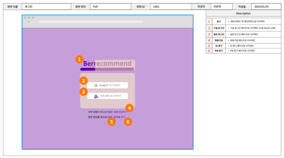

# 3차 프로젝트

## 주제: 인공지능 기반 플레이리스트 추천 및 음원 스트리밍 웹 플랫폼

### 팀명 : 베리코멘드

* 제작기간 : 25.01.17 ~ 25.02.13

* 제작인원 : 5명  
    > 맡은 역할 :  
        1. spring boot 백엔드 서버와 react 프론트 엔드 연결  
            \- 서버와 프론트 사이의 기능을 연결하고 DB와 연결할 수 있도록 API 개발 및 엔드포인트 연동을 진행하여 팀원이 구현한 서버와 프론트 페이지를 연결하여 기능이 동작하도록 하였다.   
        2. 코드 리팩토링  
            \- 기존에 있던 중복 코드를 제거하고 수정하면서 기능을 추가하였다  
            ex) session storage에 token저장, 로그아웃, 프론트 페이지 간 화면 연결 수정   
        3. 오류 검출 및 해결  
            \- 서버와 프론트 연동간에 발생한 오류 해결 ex) DB table 생성 오류, cors오류   

* 프로젝트 목표

    > \
        1. 기존 음원사이트의 기능을 벤치마킹해 개인 맞춤형 플레이리스트 기능 제공에 집중한 음원 스트리밍 웹 플랫폼 개발  
        2. 사용자의 수요를 만족시키기 위한 감정 기반 가사 분석 딥러닝 모델 개발을 통해 인공지능을 활용한 플레이리스트 추천 시스템 구현  
        3. 자바, 스프링, 리액트 등의 프레임워크를 활용한 풀스택 서비스 구현  
        4. 음원 스트리밍 플랫폼에서의 월별 구독 서비스를 통한 수익 창출 모델 구현  
        5. 깃허브에서의 문서 버전 관리를 통한 팀 협업 능력 향상  
        6. 사용자 편의를 고려한 UI/UX 설계 및 반응형 웹 구현  

* 프로젝트 내용

    사용기술 
    > 프로그래밍 도구 : VSCode, IntelliJ, MySQL workbench, Colab  
    > 사용 언어 : Java, Javascript, HTML, CSS, Python, SQL
    > 사용 프레임워크 : Spring, React

    결과물
    > 회원가입 화면입니다. 
    

        
    
