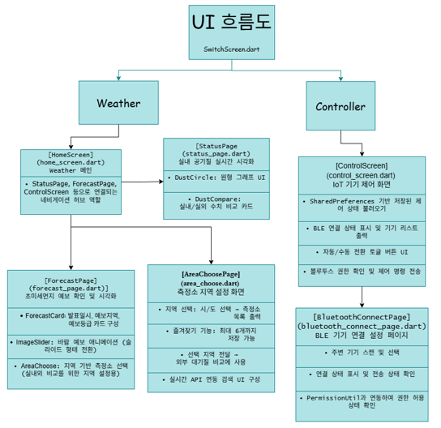
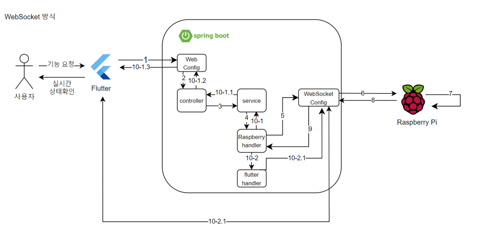
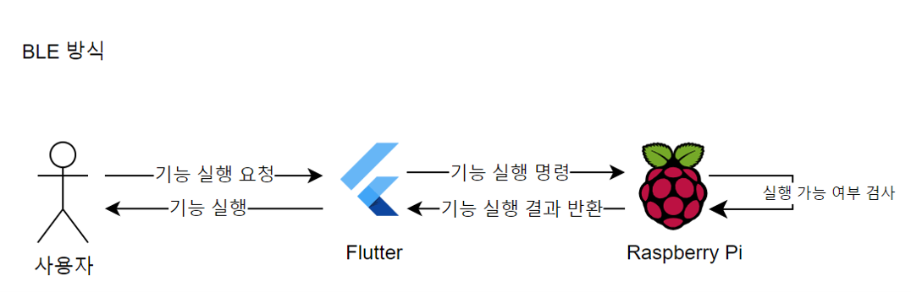

# 개인 프로젝트

### 주제: 라즈베리파이를 활용한 실시간 온습도 및 공기질 모니터링 어플 개발

* 제작기간 : 25.04.24 ~ 25.05.30

* 제작인원 : 2명

* 선정배경
    > 현재 미세먼지 농도를 파악하기 위해 다양한 앱 또는 인터넷 사이트를 통해 정보를 확인하고 있다. 하지만 이는 공공 측정소의 데이터를 기반으로 하기에 실시간성이나 개인화된 정보를 얻기 힘들다는 판단을 내리게 되었고 이에 실시간으로 측정해서 개인화 된 데이터를 제공하고자 주제를 선정하게 되었다

* 프로젝트 목표
    > 누구나 쉽게 미세먼지 측정 정보를 실시간으로 제공받을 수 있게 하는 것이 목표이다.

* 차이점
    > 라즈베리파이와 아두이노를 사용하고 PMS7003(미세먼지 센서)와 DHT11(온습도 모듈)을 사용하여 직접 값을 측정 하기 때문에 사용자의 환경의 맞는 값을 제공 받을 수 있고 이를 바탕으로 SwitchBot을 사용하여 공기청정기를 동작하게 할 수 있고 가습기 모듈을 사용하여 실내의 온습도를 제어할 수 있다.

* 주요기능
    > \
        1. 한국환경공단_에어코리아_대기오염정보API를 활용하여 원하는 지역의 미세먼지 농도를 확인할 수 있다.  
        2. API를 사용하여 가져온 외부의 공기질 농도와 센서를 이용하여 측정한 실내 공기질의 농도를 비교해서 볼 수 있다. 
        3. SwitchBot을 활용하여 IOT제어가 가능하다. 
        4. 미세먼지 센서(PMS7003)를 사용할 수 있다. 
        5. 가습기 센서를 사용할 수 있다. 
        6. 자동으로 실내의 먼지 농도와 습도를 조절할 수 있다.

* 맡은 역할
    > \
        1. 라즈베리파이 기초세팅 
        \- 라즈비안 설치, 라이브러리 설치, WSL 개발환경 세팅 
        2. 아두이노 센서 연결 
        \- 가습기 센서 연결 및 HC\-06(블루투스모듈) 연결, 라즈베리파이와 BLE통신 구현 
        3. 라즈베리파이 센서 연결 
        \- PMS7003(미세먼지센서), DHT11(온습도 모듈) 연결 
        4. Flutter 앱 개발 
        \- 라즈베리파이에 센서 실행 명령을 전송하는 페이지 제작 
        \- 블루투스 연결관리 페이지 제작 
        5. SpringBoot서버 개발 
        \- RestAPI를 활용한 서버 제작 및 라즈베리파이와 웹소켓통신 구현 
        6. GATT서버 개발 
        \- 라즈베리파이가 다른기기에서 연결을 할 수 있도록 광고를 시작하고 read,write,notify를 할 수 있는 서버 구현

* 프로젝트 내용

    사용 기술
    > 프로그래밍 도구 : AndroidStudio, inteliJ, Ubuntu-22.04LTS 
    > 하드웨어 : Raspberry 4B+, AduioUno, PMS7003(미세먼지 모듈), HC\-06(블루투스 모듈),DHT11(온습도 모듈), SwitchBot 
    > 사용 언어 : java, dart, python  
    > 사용 프레임워크 : SpringBoot, Flutter

    프로젝트 flutter 구조
    

        
    

    네트워크 통신 구조
    

        
    

    BLE 통신 구조
    

        
    
